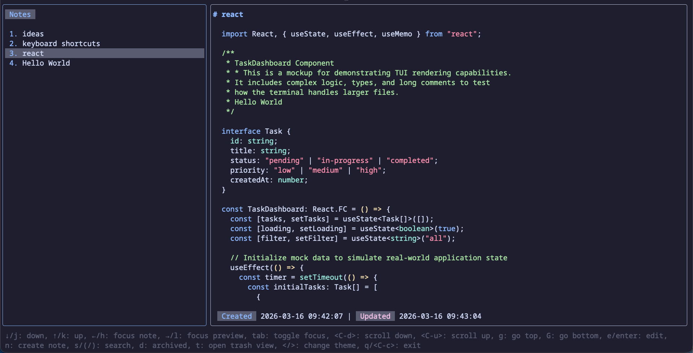
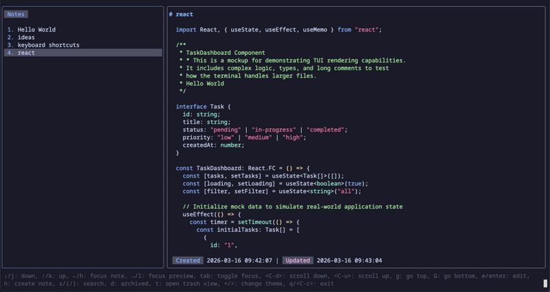
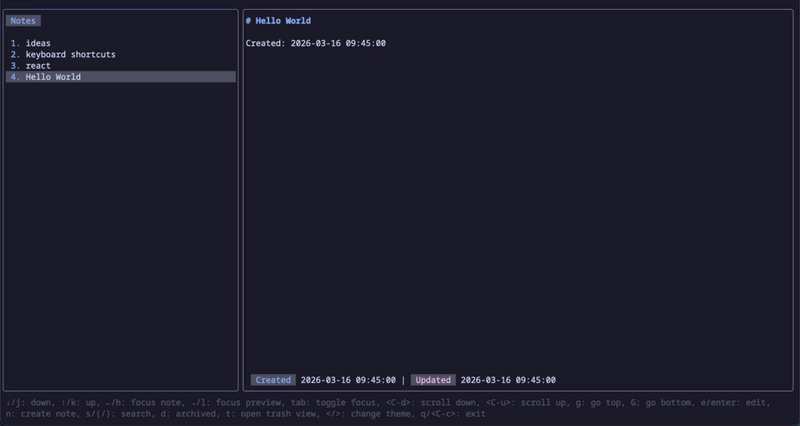
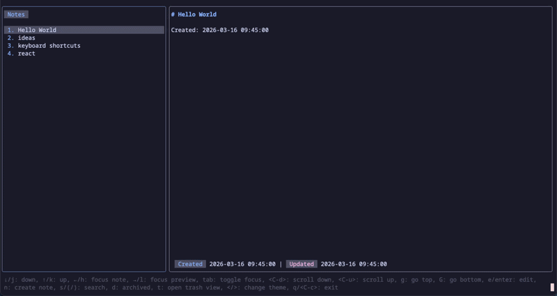
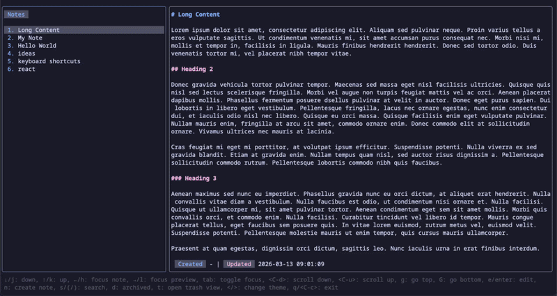

# note-tui

[](https://opensource.org/licenses/MIT)
[](https://bun.sh)
[](https://github.com/Pansther/note-tui/releases)

A **Vim-friendly** terminal user interface (TUI) application for managing notes. `note-tui` provides a clean and efficient way to interact with your notes directly from the command line, featuring a split-pane view for note listing and content preview, with full Markdown support and seamless Vim/Neovim integration.



## Features

- **Split-Pane Interface**: Dedicated panes for listing notes and previewing their content.
- **Markdown Support**: Render your notes with full Markdown syntax highlighting.
- **Intuitive Navigation**: Easily browse, select, and view notes using keyboard shortcuts.
- **Themable**: Customize the application's appearance to your preference.

## Showcases

### Run `note-tui`


### Preview Note



### Edit Note



### Search Notes



### Trash Notes (Restore and Delete)


### Themes



## Installation

Download pre-built binaries for your platform from the [Releases](https://github.com/Pansther/note-tui/releases) page.

### Homebrew (MacOS and Linux)

```bash
brew tap Pansther/note-tui
brew install note-tui
```

### Node

npm

```bash
npm i -g note-tui
```

yarn

```bash
yarn add note-tui -G
```

### From Source

To start the `note-tui` application directly from the source code, make sure you have Bun (version 1.x or higher) installed.

1. Install dependencies:

   ```bash
   bun install
   ```

2. Run the application:

   ```bash
   bun dev
   ```

## Keybindings

`note-tui` supports common Vim-like keybindings for efficient navigation and interaction within the application. This includes familiar keys like `j`, `k` for vertical movement, `h`, `l` for horizontal focus changes, and `g`, `G` for quick jumps to the top or bottom of a list.

### Idle Mode

| Key      | Description     |
| :------- | :-------------- |
| ↓,j      | down            |
| ↑,k      | up              |
| ←,h      | focus note      |
| →,l      | focus preview   |
| tab      | toggle focus    |
| ctrl+d   | scroll down     |
| ctrl+u   | scroll up       |
| g        | go top          |
| G        | go bottom       |
| e,enter  | edit            |
| n        | create note     |
| s,/      | search          |
| d        | archived        |
| t        | open trash view |
| <,>      | change theme    |
| q,ctrl+c | exit            |

### Trash Mode

| Key    | Description  |
| :----- | :----------- |
| ↓,j    | down         |
| ↑,k    | up           |
| ctrl+d | scroll down  |
| ctrl+u | scroll up    |
| g      | go top       |
| G      | go bottom    |
| r      | restore note |
| d      | delete note  |
| s,/    | search       |
| q,esc  | back to note |

### Search Mode

| Key        | Description    |
| :--------- | :------------- |
| ↓          | down           |
| ↑          | up             |
| ctrl+u     | clear          |
| return,esc | unfocus search |
| q,ctrl+c   | exit           |

## Configuration

`note-tui` stores your notes in `~/.notes`.

## License

This project is licensed under the MIT License - see the [LICENSE](LICENSE) file for details.
